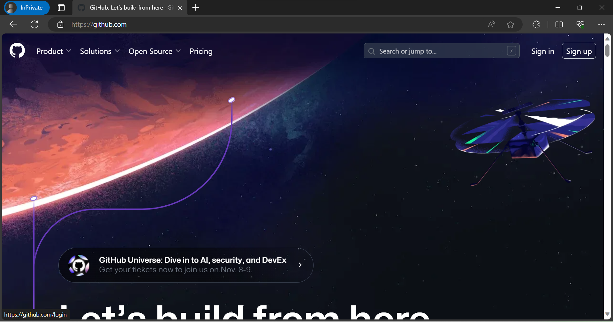
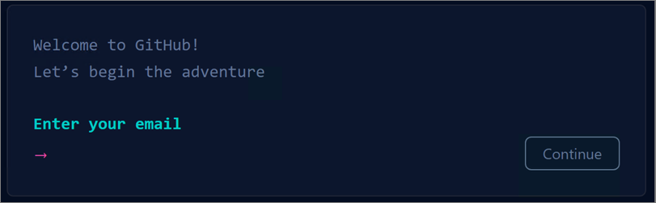
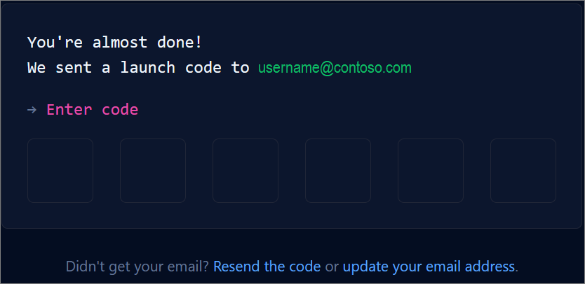
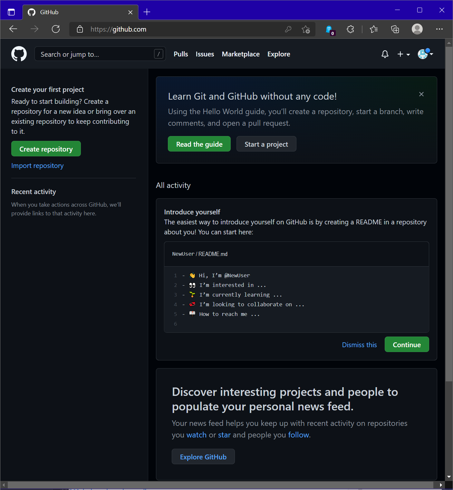
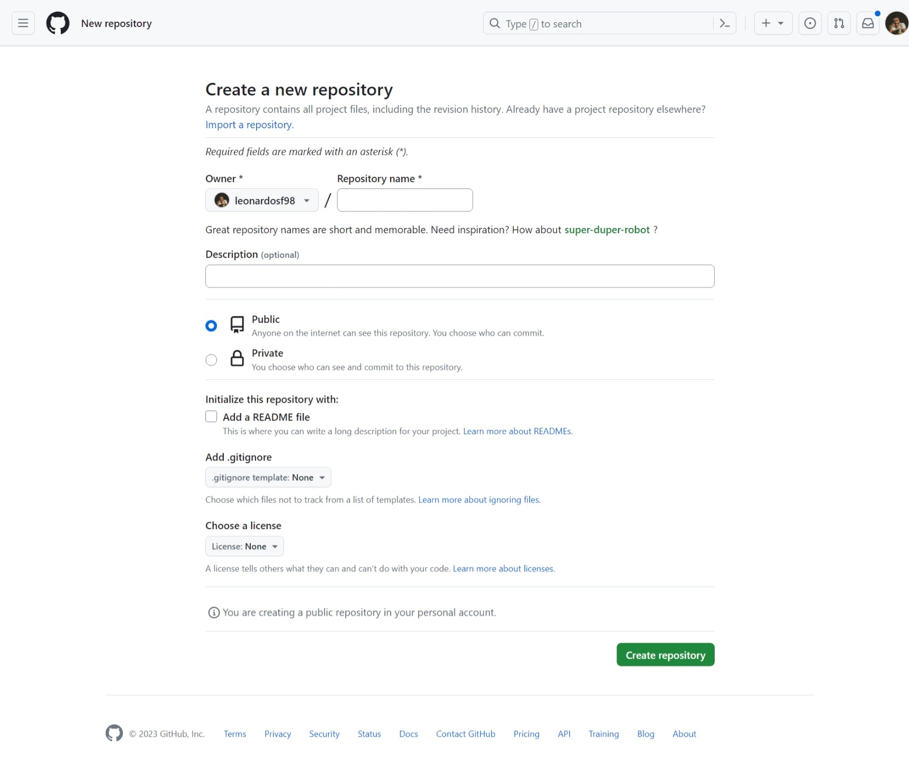
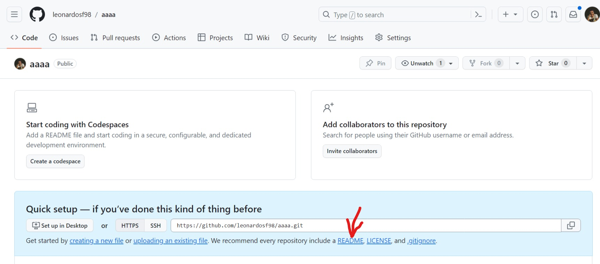
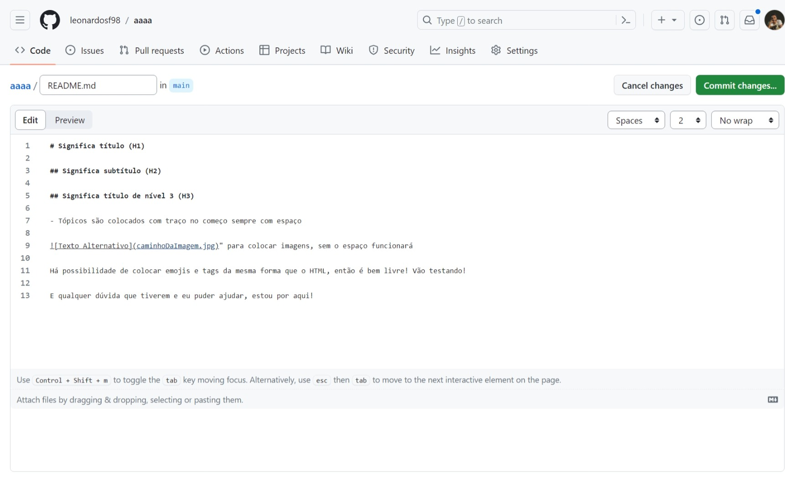
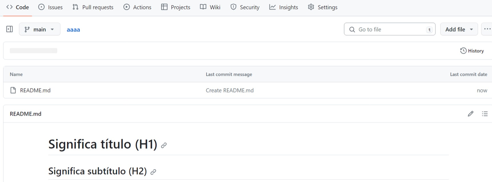

# Como criar um README.md

Readme criado para ajudar colegas de sala a criarem seus perfis no github e subirem o README.md dos projetos e seus futuros projetos!

## Crie uma conta no github
- Acesse o site https://github.com/

- Clique em Sign Up

- Nessa nova página digite seu e-mail

- Após digita o e-mail ele pedirá para digitar a senha e um nome de usuário

- Abaixo tem a opção de receber ou não anúncios e atualizações de produtos, digite "y" para receber e "n" para não receber

- Logo após ele pedirá uma verificação da sua conta e enviará um código para o e-mail cadastrado, é só digitar o código nas caixas

## Crie um novo repositório

- Esse é o lugar onde seus arquivos do site ficarão, o index.html (páginas html que você fizer), o styles.css (página da folha de estilos) e caso precise colocar imagens, ficarão aqui também!

- Primeiramente clique em "Create repository" 

- Logo abrirá uma página parecida com essa, preencha o nome do repositorio com o nome do projeto

- Na parte de baixo clique em criar repositório ("Create repository")

- Caso você tenha preenchido o nome corretamente (sem caractéres especiais e espaços) abrirá essa página

- Clique README e agora é só começar a escrever!

- Após finalizado, cliquem em "Commit changes" para salvar as alterações e atualizar o repositório, abrirá uma tela de confirmação e você clicará novamente no botão verde "Commit changes"

- E caso precisem editar novamente é só clicar no lápis da tela seguinte

